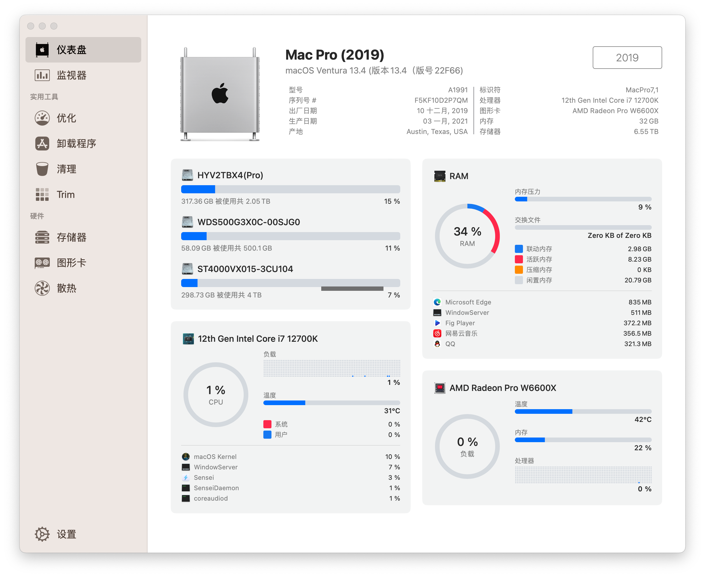
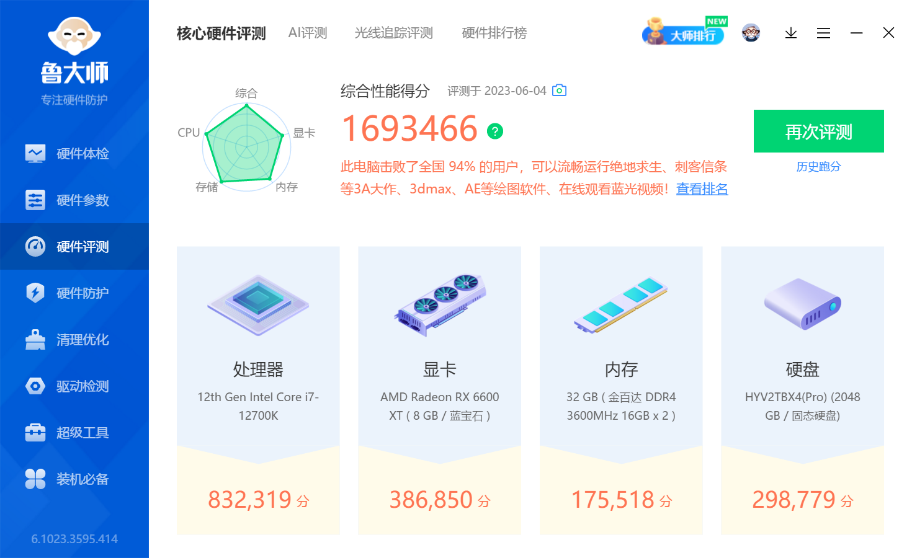

# Hackintosh-MSI-MAG-B660M-MORTAR-MAX-WIFI-12700K-RX6600XT
## 写在前面

小白第一次配置的黑苹果主机，可能EFI中还有精简或不完善的地方，大佬们看到了可以提醒我修改。

目前在黑苹果中已禁用核显，禁用了主板自带的无线网卡，使用黑苹果免驱网卡。

Windows下两个网卡都能驱动，但是蓝牙同时只能驱动一个，建议在设备管理器禁用博通蓝牙。 

使用此配置时需重新生成三码！！！

目前OC配置版本基于最新的0.9.2

## [我的常用软件备份](https://github.com/coocv/Hackintosh-MSI-B660M-MORTAR-MAX-WIFI-12700K-RX6600XT/blob/main/MyApps.md)

**[MSI-MAG-B660M-MORTAR-MAX-WIFI-DDR4指导手册](https://github.com/coocv/Hackintosh-MSI-B660M-MORTAR-MAX-WIFI-12700K-RX6600XT/blob/main/MSI.md)**

## 安装环境

### macOS

| 软件      | 版本                       |
| --------- | -------------------------- |
| macOS版本 | macOS Ventura 13.4 (22F66) |
| OC版本    | 0.9.2                      |
| 机型      | MacPro7,1                  |

### BIOS

| 选项                       | 状态 |
| -------------------------- | ---- |
| 安全启动                   | 禁止 |
| 快速启动                   | 禁止 |
| CFG锁定                    | 禁止 |
| SR-IOV Support             | 允许 |
| ARI Forwarding             | 允许 |
| Intel VT-D 技术            | 禁止 |
| D.T.M                      | 允许 |
| ErP Ready                  | 允许 |
| XMP                        | 开启 |
| USB从S3/S4/S5唤醒          | 开启 |
| USB Standby Power at S4/S5 | 允许 |

## 主机配置清单

黑苹果自用EFI，参考价格5000左右

| 设备     | 型号                                                      |
| -------- | --------------------------------------------------------- |
| 机箱     | 乔思伯U4 PLUS                                             |
| 散热器   | 利民PA120 Black                                           |
| 主板     | MSI- MAG-B660M-MORTAR-MAX-WIFI-D4                         |
| CPU      | Intel-i7-12700k                                           |
| 显卡     | 蓝宝石RX6600XT超白金                                      |
| 内存     | 金百达黑爵16G*2                                           |
| 硬盘     | 西数SN750(500G) + 幻影HV3000Pro(2T) + 海康ST4000VX015(4T) |
| 网卡     | 博通BCM94360CD                                            |
| 电源     | 鑫谷全模850 ATX3.0                                        |
| 机箱风扇 | 利民C12C                                                  |

## 运行情况

| 部件             | 运行情况 |
| ---------------- | -------- |
| 显卡             | 正常     |
| CPU              | 正常     |
| USB端口          | 正常     |
| 声卡             | 正常     |
| 有线网卡         | 正常     |
| 无线网卡（免驱） | 正常     |
| 睡眠/唤醒        | 正常     |

## 鲁大师

### Geekbench6

#### [CPU BenchMark](https://browser.geekbench.com/v6/cpu/1766444)

#### [GPU BenchMark](https://browser.geekbench.com/v6/compute/619147)

## config.plist配置

### W6600X显卡仿冒

### 声卡仿冒

